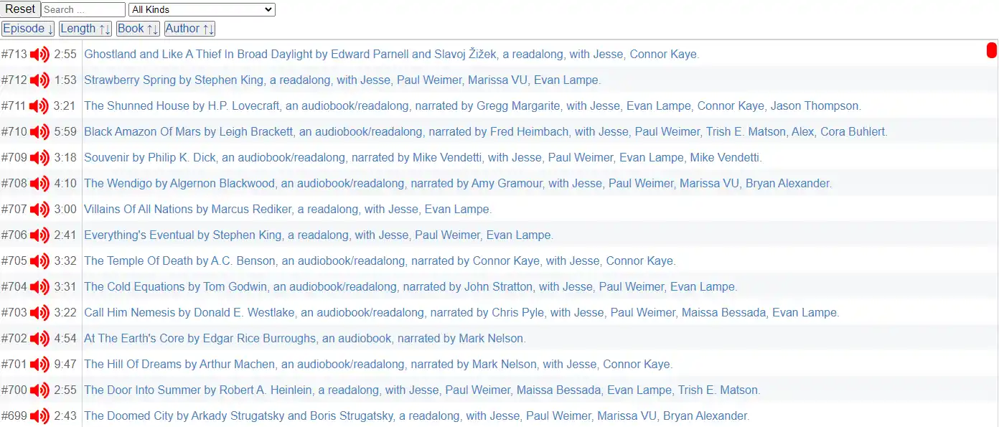
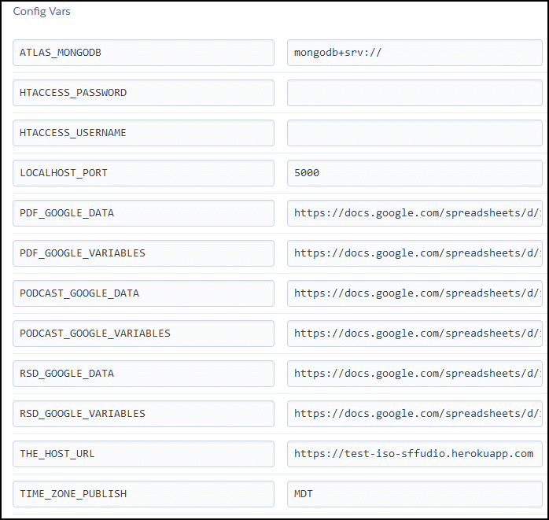
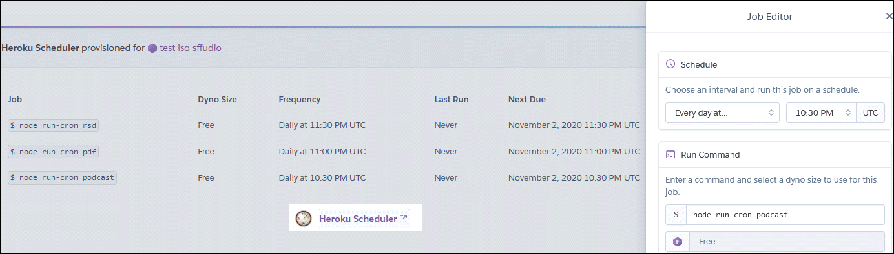

Isomorphic-React-on-Heroku takes a [Google Sheet](https://docs.google.com/spreadsheets/d/17TwPecDRNw5JS9_WT6t3cl40e5M46z8ALwnvFalHDZc)
 and saves the data in a MongoDB Atlas database to produce [isomorphic Html/JavaScript](https://sffaudio.herokuapp.com/pdf/table) via Node.js which is then injected into a non-cached [WordPress page](http://www.sffaudio.com/public-domain-pdf-page/).

  

Here are all three media types: 

PDF [WordPress page](http://www.sffaudio.com/public-domain-pdf-page/) with injected [HTML/JavaScript](https://sffaudio.herokuapp.com/pdf/table)

RSD [WordPress page](http://www.sffaudio.com/reading-short-and-deep/) with injected [HTML/JavaScript](https://sffaudio.herokuapp.com/rsd/table)

Podcast [WordPress page](http://www.sffaudio.com/the-sffaudio-podcast/)  with injected [HTML/JavaScript](https://sffaudio.herokuapp.com/podcast/table)

Heroku Environment Variables:

System Setup:

- Download [Node.js with npm](https://nodejs.org/en/download/)

- If '$ python --version' yeilds an error then install [Python](https://www.python.org/downloads/windows/)
	and add Python to global System variables PATH

- If '$ git --version' yields an error then install command line [Git](https://gitforwindows.org/)
    		and add '...Git/cmd' to global System variables PATH
    
- npm install --global gulp-cli
- npm install --global webpack 
- npm install --global webpack-cli  
    
- Get a MongoDb [Atlas database](https://www.mongodb.com/cloud/atlas)

- Download [MongoDB Compass](https://www.mongodb.com/try/download/compass) to view Atlas databases

Install:

- $ npm install

- $ npm install --force            // --force stops "npm WARN notsup SKIPPING OPTIONAL DEPENDENCY"

Build:
 
- $ gulp all

Test:

- $ gulp test --test-isomorphic-react-credentials.js    // db secrets from outiside git repo

- NB, since tests are not local sometimes one or two tests fail because of timeouts; re-run

Launch:

- $ npm start                                   // start on Heroku, secrets in 'process.env'

- $ npm start --  real-isomorphic-react-credentials.js        // start locally, db secrets from outiside git repo
    
- $ npm start --  test-isomorphic-react-credentials.js       

Cron:

- $ node run-cron rsd     real-isomorphic-react-credentials.js

- $ node run-cron pdf     real-isomorphic-react-credentials.js

- $ node run-cron podcast real-isomorphic-react-credentials.js
    
- $ node run-cron rsd     test-isomorphic-react-credentials.js

- $ node run-cron pdf     test-isomorphic-react-credentials.js

- $ node run-cron podcast test-isomorphic-react-credentials.js

Load db ( user/pass ):

- http://localhost:5000/change    // choose 'next' continuously until back at change

View:

- http://localhost:5000/
    
- http://localhost:5000/rsd/rss     https://sffaudio.herokuapp.com/rsd/rss
    
- http://localhost:5000/rsd/table   https://sffaudio.herokuapp.com/rsd/table
    
- http://localhost:5000/rsd/mobile  https://sffaudio.herokuapp.com/rsd/mobile
    
- http://localhost:5000/change      https://sffaudio.herokuapp.com/change      

Examples:

- https://sffaudio.herokuapp.com/rsd/table       
    
- https://sffaudio.herokuapp.com/pdf/table    
    
- https://sffaudio.herokuapp.com/podcast/table  

 3212 a town like alice
 20209 documents
